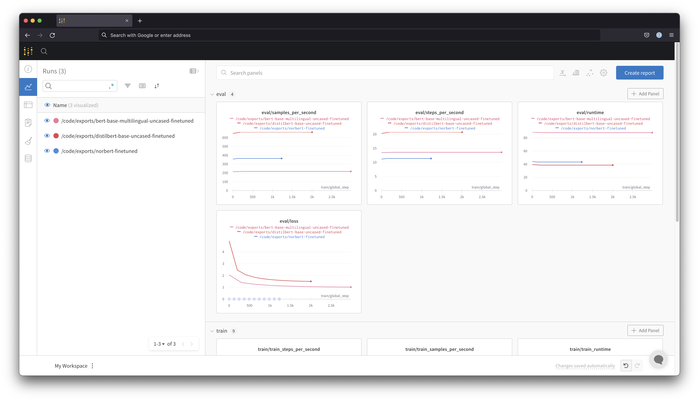

# Training the language model
## How to 
The code is made so that it should be very easy to train an experiment with new bert variants from [huggingface models hub](https://huggingface.co/models).

The main file you have to work with is the `config/hparams.yml` file. In the file itself, you can find small description of the fields.

Once you edited and set the parameters of your choice, makes sure you can in the root directory of the project, then you can run the training as follows
```bash
PYTHONPATH=src/ python src/language_modeling/training/main.py
```
This will run the training in the foreground, Which might be interrupted if the SSH session hangs for your terminal exists. To run it in the background you can do the following

```bash
chmod +x ./scripts/run_training.sh
nohup ./scripts/run_training.sh &
```

## Monitoring

The training script is set to send metrics to a widely used machine learning monitoring service called [`Weights and Biases`](https://wandb.ai). When you first run the training script, it will ask you for a simple instructions to set the `Weights and Biases` authentication parameters. Once you do that you should start seeing runs being logged on your dashboard as below

